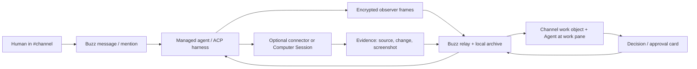

# Buzz One: the human-and-agent workspace

Buzz One is a **conversation-first agent workspace** built on the Buzz relay.
Its central bet is that agents are *members of the room*, not tenants of a
separate control panel: shared channels and threads stay home, and when an
agent researches, browses, drafts, changes data, or needs a decision, that
work shows up as a visible, reviewable participant in the same channel where
the people involved are already collaborating. Buzz One does not add an AI
dashboard beside the workspace — it makes the workspace legible to agents and
agents legible to the workspace. The visual language is the light **Team
Table**: warm off-white, ink text, a single forest-green collaboration accent,
and orange reserved strictly for consequential review. This document is the
design-plus-engineering specification an engineer can start Phase 1 from.

---

## The live prototype

The canonical reference lives at [`./design/index.html`](./design/index.html) —
open it in a browser. It renders the **Team Table shell** (left rail, centre
room, right context pane) as a working three-pane channel screen, and it is the
visual source of truth for all five build phases: the interactive work object,
the Thread ↔ Agent-at-work pane switch, decision and evidence cards, the routine
and execution-profile forms, connector cards and the Computer Session viewport,
and the operator command bar. The token swatches and type scale in this document
are lifted directly from its `<style>` block, so the two stay in lockstep.

The prototype is a **single, committed light theme by design**. The Team Table
contract forbids a dark-mode language for this initial channel experience, so
every colour and background is painted explicitly and there is no theme toggle.
That is a deliberate scope decision, not an omission — dark mode, if it ever
ships, is a later optional view and never Buzz One's home.

---

## Non-negotiable Team Table contract

Treat the prototype as the visual contract for the first Buzz One channel
screen. The following rules are not stylistic preferences; they are the shape
of the product.

- **Left rail — the workspace.** Search, unread work, threads, mentions,
  drafts and saved items; then Channels, Direct messages, and an **Agents**
  group. Agents are people-shaped rows carrying an `AI` marker, a presence dot,
  and a readable state (`Active` / `Idle`) — not a separate fleet dashboard.
- **Centre — the room.** The centre pane is *always* the channel. It supports
  normal human chat first; rich agent work lives as an attachment beneath the
  message that introduced it. Keep the generous message rhythm, hairline
  dividers, reactions, threads, and the full-width composer from the prototype.
- **Right pane — context.** A true thread by default, at a fixed width with a
  clear close affordance and return path. It may switch to **Agent at work**
  only through an explicit tab control, and that mode reuses the exact same
  width, header, and close behaviour as the thread.
- **Work object — a meaningful, bordered surface.** Following the Salesforce
  example in the prototype: title + source glyph, terse execution state,
  source, a human-readable outcome summary, a revealable change/evidence
  preview, and exactly one explicit review action. Because it is a real object
  a member acts on, it is one of the few appropriate uses of a bordered card.
- **Forest is the only accent.** The forest-green chosen-state and primary
  action are the single collaboration accent. **Orange is used only for action
  with material risk** — irreversible or consequential review — and never for
  routine activity.
- **No dark mode, no kanban, no dashboard KPI tiles** in the initial channel
  experience, and no floating "agent cockpit". Those may become optional views
  later; they are explicitly not Buzz One's home.

---

## Design tokens

These values match [`./design/index.html`](./design/index.html) exactly. Names
are the CSS custom properties defined on `:root` in the prototype.

### Colour

| Token | Hex | Role |
| --- | --- | --- |
| `--surface` | `#FCFBF8` | App + page ground (warm off-white) |
| `--raised` | `#FFFFFF` | Cards, composer, work objects, panels |
| `--rail` | `#F6F4EF` | Left rail / sunken surface |
| `--rail-hover` | `#EFEDE6` | Hover fill on rail rows |
| `--context` | `#FAF9F5` | Right context pane |
| `--ink` | `#1C1E1B` | Primary text |
| `--muted` | `#74766F` | Secondary text |
| `--faint` | `#9C9E94` | Timestamps, tertiary text |
| `--divider` | `#E9E8E3` | Hairline dividers |
| `--border` | `#E3E1D9` | Card / control borders |
| `--border-strong` | `#D7D5CB` | Emphasised borders, avatar rings |
| `--forest` | `#075B43` | Primary action, chosen-state (the single accent) |
| `--forest-ink` | `#0B6B51` | Links, focus ring, hover |
| `--forest-tint` | `#EAF1EC` | Selected channel fill, subtle accent |
| `--forest-tint-2` | `#DBE9E0` | Stronger accent fill, selection |
| `--forest-line` | `#BFD6C8` | Accent-surface borders |
| `--warn` | `#D97706` | Consequence / review — **material risk only** |
| `--warn-ink` | `#B45309` | Warn text, hover |
| `--warn-tint` | `#FCEFDA` | Decision-card fill |
| `--warn-line` | `#F0CE9B` | Decision-card border |
| `--ok` | `#1E9E6A` | Active presence, success dot |
| `--ai` | `#5F6159` | `AI` marker ink |
| `--ai-bg` | `#EDEBE4` | `AI` marker fill |

Guardrails carried from the visual contract: no gradients, no dashboard card
grid, and no more than one "loud" (forest primary) action in view at once.
Orange appears only on the decision/consequence path.

### Type scale

Chat is the base type size. Meta text sits one or two steps below it; agent
activity labels are a fixed 12px. Use rem-based tokens in the desktop app so
text scales with zoom.

| Element | Size | Notes |
| --- | --- | --- |
| Chat body / message text | 16px (base) | The app's base type size |
| Message author | 15px | Semibold |
| Section / room title | 17px | Semibold |
| Work-object title | 15px | Semibold |
| Meta text (timestamps, `by` lines, counts) | 11–12px | The sub-`text-xs` meta ramp |
| Agent activity labels | 12px | Plan steps, status lines |
| Activity timestamps / tracking labels | 11px | Mono, uppercase for section labels |

Comfortable message measure is roughly 60–70 characters (`--measure: 66ch`).

### Radius

| Token | Value | Applies to |
| --- | --- | --- |
| `--r` | 12px | Cards, work objects, panels, composer |
| `--r-sm` | 8px | Controls, buttons, chips, nav rows |
| `--r-lg` | 16px | Command bar, mini-screens |
| `--r-xl` | 22px | Outer specimen frame |
| pill | 999px | Presence pills, reactions, status pills, model tags |

### Motion

- A work object expands with a short **160–200ms height/opacity** transition;
  the caret rotates on the same easing.
- The agent activity line **cross-fades** rather than reflowing the timeline on
  every step.
- A running status dot pulses (`@keyframes pulse`, ~1.6s); selecting a live
  screenshot uses a shared-layout transition into the right pane.
- A resolved approval compresses in place and emits a normal channel message,
  preserving conversational continuity.
- **Respect reduced motion.** The prototype disables animation and collapses
  transition durations under `@media (prefers-reduced-motion: reduce)`; the
  desktop app must do the same.

---

## Evidence-led capability map

Each row maps a proven OpenMausBot / Grok Bot pattern to what it achieves, the
existing Buzz seam it lands on, and the recommended Buzz One adaptation.

| Pattern | What it achieves | Buzz One starting point | Recommendation |
| --- | --- | --- | --- |
| Agent roster treated like contacts | Agents feel like teammates; fast mental model | Managed agents, personas, teams, profiles, sidebar already exist | Add an **Agents** sidebar group with status, task headline, unread/action count, and a compact context menu |
| Streaming tool activity in the conversation | Progress is visible without reading raw logs | Encrypted observer frames (`KIND_AGENT_OBSERVER_FRAME` = 24200), `ManagedAgentSessionPanel`, `AgentSessionThreadPanel`, `BotActivityBar` | Promote the observer transcript into a native, concise **work object** attached to an agent message; raw events become an advanced view |
| Inline questions and permission cards | Low-friction steering with audit context intact | Workflow approvals and a run-trace UI already exist | Render approval/question cards **inside the timeline** — Allow once, Allow for mission, Deny, or reply — each bound to the exact proposed tool/action |
| Live computer panel + screenshots in transcript | A human can supervise browser/desktop work | Terminal and agent-session panes exist; the computer viewport is the gap | Introduce a provider-neutral **Computer Session** with a live right-pane preview and immutable snapshots posted as evidence |
| Cloud / local / disabled computer per agent | Clear scope and safer execution | Managed-agent settings and harness config already exist | Add an explicit per-agent execution target: `none`, `sandbox`, `cloud desktop`, `approved local computer` — default `none` |
| Provider/model choice per agent | Fit model, cost, and capability to the work | Provider/model config and model-picker observer support exist | Surface a simple model selector in the agent profile; keep advanced provenance in the config panel |
| One-click connected-app marketplace | Makes useful capabilities discoverable | MCP server configuration and persona packs exist | Ship a curated connector catalogue first; connect via OAuth; attach access to a persona/agent and disclose scope in the channel |
| Secrets are write-only / status-only | Avoids credential leakage | Agent config already separates provenance from config | Store connector secrets in the OS keychain / relay-side encrypted store; the UI shows `Connected`, account, scopes, last use — never raw keys |
| Bot lifecycle actions from the sidebar | Agents are easy to pin, hide, duplicate, maintain | Managed-agent CRUD and agent config exist | One agent context menu: pin, mute, pause, duplicate from persona, archive, open work, settings |
| Dictation in the composer | Faster human steering | The desktop composer is the natural insertion point | Add dictation behind an explicit microphone permission; the transcript is editable before send |
| Scheduled routines | Work becomes dependable, not only conversational | `buzz-workflow` supports cron/interval triggers | Rebrand the user-facing flow as **Routines**: "Every weekday at 08:30, review pipeline and post to #sales" |
| Friendly identity / role expression | Legible social presence for agents | Buzz profiles and avatars already exist | Give every agent a role, avatar, and capability summary; treat mascots as optional cosmetic packs, never a dependency |

### Critical adaptation

Do **not** transplant OpenMausBot's local HTTP + SSE ownership model into Buzz.
That model suits a single-Mac app, but Buzz already has the stronger shared
source of truth: signed relay events, identities, channels, search, and
approvals. Reuse OpenMausBot's *interaction patterns* and driver discipline, but
express the resulting state through Buzz's event model and the existing
encrypted observer stream. Concretely: the relay is authoritative, the desktop
app is a view, and no agent "owns" a local port that the rest of the workspace
cannot see or audit.

OpenMausBot ships no `LICENSE` / `NOTICE` in the inspected repository root.
Treat it as a product reference and reimplement patterns cleanly — do not copy
source, assets, or branding until licensing is clarified.

---

## Ten game-changing increments

Priorities assume one cross-functional desktop/agent team. "Effort" is a
delivery estimate after design and acceptance criteria are agreed, not elapsed
calendar time (S = small, M = medium, L = large).

| # | Increment | Why it changes the product | Existing seams | Effort | Acceptance test |
| --- | --- | --- | --- | --- | --- |
| 1 | Agent work objects in channel | Turns invisible tool use into a team-readable artifact | `AgentSessionThreadPanel`, `ManagedAgentSessionPanel`, observer-frame parser | M | A running agent posts one collapsing/expanding work object with status, latest step, sources/artifacts, and a stop control |
| 2 | Native decision cards | The human steers in one click without breaking flow | `WorkflowApprovalCard`, run-trace UI, workflow approval kinds | S–M | A decision appears in-channel, keyboard choices work, and the resolved choice becomes a signed, auditable message |
| 3 | Right-pane Agent at work | Grok Bot's supervision loop without leaving the conversation | `AgentSessionThreadPanel`, channel split-pane state | M | Selecting an active agent shows plan, transcript summary, artifacts, and last update; close returns to the thread |
| 4 | Agent roster as a social surface | Makes agents discoverable, understandable, manageable | `AppSidebar`, managed-agent hooks, profile data | S | Sidebar shows active/idle/needs-you; context menu supports pin, mute, pause, open work |
| 5 | Evidence packs | "Trust me" becomes inspectable claims and sources | messages/media, canvas, observer transcript | M | An agent attaches sources, screenshots, changed files, and a concise rationale to a channel post |
| 6 | Computer Session v1 | Lets a human observe browser/desktop action and take over | Tauri desktop layer, observer frames, media storage | L | One sandbox/cloud desktop streams preview frames, posts a final snapshot, and enforces a stop button |
| 7 | Connector catalogue v1 | Converts a generic agent into a work colleague | MCP config, personas, keychain-backed desktop config | L | Gmail, GitHub, and Salesforce can be connected, scoped, attached, revoked, and shown in the agent profile |
| 8 | Routines | Makes recurring operational value obvious | `buzz-workflow` cron/interval scheduler, workflows UI | M | A non-technical user creates "weekday 08:30 pipeline brief", sees next run, pauses it, reviews run history in-channel |
| 9 | Model and execution profiles | Makes capability, cost, and risk intentional per agent | `AgentConfigPanel`, provider/model config, personas | M | Agent profile selects an approved model and execution target; every work object shows the effective profile |
| 10 | Operator command bar + dictation | Lowers the cost of initiating and steering work | channel composer, desktop permissions | S–M | "Ask Buzz One…" turns a request into a scoped agent proposal; dictation is editable and never auto-sent |

**Recommended order.** Ship 1–4 as the *conversation-first operating loop* —
they make the product visibly different with minimal new infrastructure. Ship 5
and 8 next to make work explainable and recurring. Build 6 and 7 as guarded
capability platforms, then 9 and 10 as the finishing leverage layer.

---

## Build guide — five phases

Before Phase 1, establish a safe baseline: branch from the current Buzz One
customization and record the upstream commit; run `just setup`, `just check`,
`just test-unit`, and use `just dev` for desktop + relay; then seed a test
community with two human identities, two managed agents, one channel, one
approval-gated workflow, and fixture observer frames. Write the interaction
spec first — a salesperson asks an agent in `#go-to-market`, the agent works,
asks for a consequential decision, receives approval, then posts evidence and a
conclusion. Every phase below is a slice of that one story.

### Phase 1 — conversation-first shell

**Increments 1–4.**

**Goal.** Make agent work a first-class, reviewable object *inside* the channel,
and give agents a social home in the sidebar — with no new backend surface.
Everything derives from data that already exists.

**Files and seams.**

| Seam | Change |
| --- | --- |
| `desktop/src/features/channels/ui/ChannelScreen.tsx` | Keep the channel as the root; add `AgentAtWorkPane` as a selectable right-pane mode alongside the thread |
| `desktop/src/features/channels/ui/BotActivityBar.tsx` | Evolve the active-agent control into a compact per-channel activity ribbon; preserve keyboard and hover-only behaviour |
| `desktop/src/features/channels/ui/AgentSessionThreadPanel.tsx` | Extract a summary view (`plan`, `recent activity`, `artifacts`, `stop`); keep the raw event rail under "Developer details" |
| `desktop/src/features/agents/ui/ManagedAgentSessionPanel.tsx` | Provide reusable display blocks, not a second standalone product surface |
| `desktop/src/features/sidebar/ui/AppSidebar.tsx` | Add the Agents group and agent context menu without disturbing the channel/DM hierarchy |
| `desktop/src/features/agents/useOpenAgentActivity.ts` | Wire the work object's "Open agent work" control to the existing activity/session behaviour |
| `crates/buzz-core/src/kind.rs` | Source of derivation: `KIND_AGENT_OBSERVER_FRAME` (24200), an ephemeral kind, drives the view model — no new kind required in this phase |

**Prototype anchors.** The `.wo` work object (collapsed one-liner + expanded
rows + footer action); the `.rail` Agents group (`.prow` rows with `.aimk` `AI`
marker and `.dot` presence); the `.ctx` right pane with `Thread` / `Agent at
work` tabs, the `.plan` checklist, and the `.feed` activity timeline.

**Component spec — work object (`.wo`).** Collapsed, it is a single line:
`Atlas · Salesforce lead sync · completed · 142 leads · Review change`.
Expanded, it shows purpose/title with a source glyph, an execution-status line,
source, a human outcome summary, a revealable change/evidence preview, and one
primary safe action. It never renders raw tool JSON. Derive a
`WorkObjectViewModel` from observer transcript blocks, scoped by correlation/
session ID **and** channel ID.

Work-object states:

| State | Status line | Dot | Timeline behaviour | Primary action |
| --- | --- | --- | --- | --- |
| Idle | "Idle · queued" | muted, no pulse | Static, collapsed by default | None (or "Start") |
| Running | "Working…" + latest step | forest, pulsing | Activity line cross-fades on each step | Stop (in Agent-at-work pane) |
| Interrupted | "Interrupted" | orange (`--warn`) | Frozen at last step | Resume / Discard |
| Error | "Failed" + reason | red (`#C4402E`) | Frozen; error surfaced, not raw stack | Retry / View error |
| Completed | "Completed successfully" + time | green (`--ok`) | Collapses to the one-liner | Review change (forest primary) |

**Component spec — Agents sidebar group.** People-shaped `.prow` rows built
from existing profile/avatar/status data — do not create a second source of
truth. Each row: avatar, name, `AI` marker, presence dot (`on` = active, `off`
= idle, `busy` = needs-you), and an optional state label. The context menu
carries pin, mute, pause, duplicate from persona, archive, open work, settings.

**Component spec — right pane (`.ctx`).** Thread is the default. The `Agent at
work` tab shows: a header (agent, current task, a `Working` pill), a **Plan**
checklist (done / now / todo markers), a **Recent activity** feed (concise,
timestamped, not raw logs), an **Artifacts** list, and a footer with "Open full
transcript" and a `Stop` control styled as a warn-ghost button. Closing the
pane returns to the thread at the same width.

**Acceptance criteria.**

- A running agent posts exactly one work object under its initiating message; it
  collapses and expands with the 160–200ms transition and honours reduced motion.
- All five work-object states render correctly, including reconnect and
  multi-agent channels; visual tests cover each state.
- The Agents group reflects live active/idle/needs-you state and its context
  menu actions work.
- Opening Agent-at-work replaces the *right pane*, never the channel, and close
  returns to the thread.

### Phase 2 — decisions and evidence

**Increments 2 and 5.**

**Goal.** Let a human steer consequential work in one click, and make agent
claims inspectable — decisions and evidence both become ordinary, searchable,
signed channel events.

**Files and seams.**

| Seam | Change |
| --- | --- |
| `desktop/src/features/workflows/ui/WorkflowApprovalCard.tsx` | Extract from the workflow-run surface into a message-embeddable component with a typed `ApprovalRequest` input |
| `crates/buzz-core/src/kind.rs` | Reuse existing approval kinds: `KIND_WORKFLOW_APPROVAL_REQUESTED` (46010), `_GRANTED` (46011), `_DENIED` (46012); grant/deny via `KIND_APPROVAL_GRANT` (46030) / `KIND_APPROVAL_DENY` (46031) |
| messages / media / canvas | Evidence renderers persist as ordinary channel content the humans can search, react to, and thread |

**Prototype anchors.** The `.decision` card (warn-tinted, with badge, question,
meta, choices, and a resolved state that compresses to a pill); the `.artifact`
chips with `--doc`, `--img`, `--data`, `--file` variants.

**Component spec — decision card (`.decision`).** Compact and visually distinct
(warn-tinted, because a decision has consequence): a `Decision` badge, the
question/consequence, a meta row binding the choice to the exact actor, tool/
connector, target, and scope, then 2–4 choices — **Allow once**, **Allow for
mission**, **Deny** — plus a "reply with context" affordance. Keyboard hints are
shown. On resolution it condenses in place to the chosen pill and "Emitted as an
auditable event", and emits a signed channel message recording who decided and
when. Each choice is bound to the observer/run correlation ID so the *correlated*
work resumes — nothing else.

**Component spec — question card.** A non-consequential sibling of the decision
card: a prompt with 2–4 choices and a free-text fallback, each choice bound to
the correlation ID. Used when the agent needs a preference, not a permission.
Because it carries no material risk, it stays on the neutral surface, not orange.

**Component spec — artifact renderers (`.artifact`).** Every evidence type has a
title, origin, freshness timestamp, permission scope, and an open/download
action:

| Renderer | Prototype icon variant | Example |
| --- | --- | --- |
| Source | `--doc` / default | "Read customer outcomes from #customer-stories" |
| File change | `--file` | A diff or changed-file reference |
| Draft | `--doc` | "Email openers v2 · Google Docs · updated 9:13 AM" |
| Screenshot | `--img` | An immutable Computer Session snapshot |
| Data result | `--data` | "Account intent scores · 20 rows" |

Require an evidence pack whenever an agent claim changes data, contacts
customers, or recommends a consequential action.

**Acceptance criteria.**

- A decision renders in-channel; keyboard choices work; the resolved choice
  becomes a signed, searchable message and resumes only the correlated work.
- A high-impact action cannot execute before the correct approval; deny and
  timeout are safe, explicit, and default to stop.
- A completed action posts evidence — not only prose — and every artifact link
  respects the viewer's permission scope.

### Phase 3 — routines and execution profiles

**Increments 8 and 9.**

**Goal.** Make recurring work dependable and make each agent's capability, cost,
and risk intentional — both built on existing configuration, not a new one.

**Files and seams.**

| Seam | Change |
| --- | --- |
| `crates/buzz-workflow` | Build "Create routine" on top of the existing cron/interval scheduler — do not add a second scheduler |
| `AgentConfigPanel` (agents feature) | Keep as the advanced/provenance view; the new profile surface translates safe defaults into this config rather than hiding it |
| personas (`buzz-persona`) | Execution profiles are persona-level: model, capability allowlist, connector grants, computer target, budget, approval policy |

**Prototype anchors.** The routine form (`.field` / `.input` / `.select` /
`.toggle`); the execution profile's model selector (`.pill--model` mono pills),
capability chips (`.chip` / `.chiprow`), computer-target `.segmented` control,
and budget `.meter`.

**Component spec — routine form.** The first form needs only: task prompt,
channel, agent, schedule (natural-language cron/interval, e.g. "Every weekday
at 08:30"), and approval policy. It surfaces **next run** and **last result**
in the channel context or agent profile — no separate routine dashboard first.

**Component spec — execution profile.** A persona-level card:

| Field | Control | Notes |
| --- | --- | --- |
| Provider / model | `.pill--model` mono selector | See the model note below |
| Capability allowlist | `.chip` / `.chiprow` toggle chips | Explicit, least-privilege |
| Connector grants | connector rows | Feeds Phase 4 |
| Computer target | `.segmented`: none / sandbox / cloud / local | Default `none` |
| Budget | `.meter` | Time/compute ceiling |
| Approval policy | `.select` | Ask-once / per-mission / always-ask |

**Model selection (increment #9).** Each agent picks its own model, so
capability, throughput, and cost are chosen per role and reflected by the
prototype's model selectors:

| Tier | Best for |
| --- | --- |
| Opus | Deep reasoning — planning, analysis, high-stakes drafting |
| Sonnet | Balanced throughput — everyday work at good speed and cost |
| Haiku | Fast and cheap — high-volume, low-latency, routine tasks |

Every work object shows the **effective profile** (model + execution target) so
a reviewer always knows what produced a result.

**Acceptance criteria.**

- A non-technical user creates a "weekday 08:30 pipeline brief" routine, sees its
  next run, pauses it, and reviews run history in the owning channel.
- An agent profile selects an approved model and execution target; the effective
  profile appears on every work object that agent produces.

### Phase 4 — connectors and Computer Session

**Increments 6 and 7.**

**Goal.** Turn a generic agent into a work colleague with scoped, revocable
connectors, and let a human observe (and take over) browser/desktop action —
both introduced as guarded platforms, not demos.

**Files and seams.**

| Seam | Change |
| --- | --- |
| MCP server configuration (`McpServersSection`, `buzz-dev-mcp` boundary) | Use MCP config as the integration boundary; ship a curated manifest/catalogue rather than allowing arbitrary remote servers by default |
| personas + keychain-backed desktop config | Attach connector access to a persona/agent; store secrets in the OS keychain / relay-side encrypted store |
| Tauri desktop layer, observer frames, `buzz-media` | Normalize computer activity into observer frames + media artifacts so every provider yields the same Buzz One UI |

**Prototype anchors.** Connector cards (`.panel` + `.logo--gmail` / `--github` /
`--salesforce` / `--slack` / `--notion` / `--linear`) with `.pill--ok` /
`.pill--warn` status; the Computer Session `.viewport` with its live capture
badge (`.viewport__live` with the pulsing `rec` dot) and the `.viewport__stop`
control.

**Component spec — connector cards.** Start with three connectors a user can
explain — **Gmail, GitHub, Salesforce**. Each card shows the logo, connected
account, granted scopes, last-used time, a revoke action, and agent assignments.
Connect via OAuth. Secrets are **write-only / status-only**: the UI shows
`Connected`, account, scopes, and last use — never raw keys.

**Component spec — Computer Session (`.viewport`).** A live preview in the right
pane with an always-visible capture indicator and a persistent stop control;
immutable snapshots are posted as work evidence. Execution targets:

| Target | Meaning | Default |
| --- | --- | --- |
| `none` | No computer access | ✓ default |
| `sandbox` | Ephemeral, isolated sandbox | |
| `cloud desktop` | Isolated cloud desktop | |
| `local computer` | Approved local machine, desktop-owned | Highest bar to enable |

Implement cloud/sandbox preview **before** local control; ship local mode only
after OS-permission, process-ownership, and stop-control tests pass. See the
[Computer Session safety contract](#computer-session-safety-contract) below.

**Acceptance criteria.**

- Gmail, GitHub, and Salesforce can each be connected, scoped, attached to an
  agent, revoked, and shown in the agent profile; no secret value renders in the
  DOM, logs, or a copied work object.
- One sandbox/cloud desktop streams preview frames, posts a final snapshot as
  evidence, and enforces a working stop button.
- Every provider's computer activity arrives as the same observer-frame + media
  UI — no provider-specific surface.

### Phase 5 — operator polish

**Increment 10.**

**Goal.** Lower the cost of initiating and steering work, and finish the rough
edges that make a workspace feel trustworthy day to day.

**Files and seams.**

| Seam | Change |
| --- | --- |
| channel composer (`ChannelScreen` composer) | Add the "Ask Buzz One…" launcher and dictation entry point |
| desktop permissions (Tauri) | Microphone permission gate for dictation; explicit, revocable |

**Prototype anchors.** The command bar (`.cmdbar`) with its proposal block
(`.cmdbar__prop` / `.proprow`); the composer's dictation control in the
`.composer__foot` tool row.

**Component spec — command bar (`.cmdbar`).** An "Ask Buzz One…" launcher turns
a natural-language request into a *scoped proposal* before any broad work
begins. The proposal block previews the resolved **agent**, **channel**,
**capabilities**, and **approval policy** as editable rows, so the human
confirms scope up front rather than discovering it mid-run.

**Component spec — dictation.** A microphone control in the composer behind an
explicit OS permission. The transcript is inserted into the composer as editable
text and is **never sent automatically** — dictation is an input aid, not an
autonomous path.

**Acceptance criteria.**

- "Ask Buzz One…" produces a scoped proposal (agent, channel, capabilities,
  approval policy) that the user can edit before work starts.
- Dictation requires explicit permission, yields editable text, and never
  auto-sends.
- Empty states, interrupted-work recovery, offline state, ownership transfer,
  and keyboard shortcuts are handled and reviewed.

---

## Architecture — keep the relay authoritative

The Buzz relay is the single source of truth. The desktop app is a view over
signed relay events; agents, connectors, and computer sessions all flow their
state back through the relay so the whole workspace can see, search, and audit
it.

### Event strategy

1. **First release: derive, don't invent.** Build the UI from existing
   encrypted `KIND_AGENT_OBSERVER_FRAME` (24200) activity and existing
   workflow/approval events. Persist only user-visible evidence as ordinary
   channel messages, media, or canvas content.
2. **Add explicit work-object events only when queries need them.** A
   lightweight addressable `agent_work_item` event should carry agent pubkey,
   channel ID, state, summary, artifact references, and a correlation/session
   ID — and must render harmlessly on older clients. Add the kind in
   `buzz-core/src/kind.rs` first, then handle it in the relay.
3. **Never put secrets or raw screen recordings in general chat by default.**
   Store media under access-controlled references; post a redacted preview plus
   provenance. The owner decides whether a snapshot is shared with the channel.
4. **Permission is not a boolean.** Record actor, action summary,
   tool/connector, target, scope, expiry, the resulting event, and any optional
   policy grant. **Default an unanswered request to deny/stop.**

---

## Computer Session safety contract

Computer access is powerful and is introduced as a platform, not a demo.

- **Execution targets:** `none` (default), ephemeral sandbox, isolated cloud
  desktop, and approved local computer — in ascending order of bar-to-enable.
- **Local computer mode requires** desktop-owned OS permissions, an
  always-visible capture/automation indicator, a hardware/keyboard stop
  shortcut, per-step approval by default, and **no hidden background input**.
- **Cloud / sandbox mode** gets separate credentials, a per-agent browser
  profile / cookie jar, a network allowlist, and a time/compute budget.
- **Capture cadence:** a frame is sampled only while a session is active; the
  preview cadence is adaptive; the last frame may be attached as evidence only
  after the user's policy allows it.
- **Authentication hand-off:** browser automation must surface MFA/CAPTCHA
  hand-off clearly to the human. Never bypass MFA or anti-bot controls, and
  never encourage doing so.

---

## Verification gates

### Behavioural acceptance

- A human can create or mention an agent in a shared room; the agent's work is
  visible **without leaving the channel**.
- An agent can ask a multiple-choice question and the response resumes **only**
  the correlated work.
- A high-impact action cannot execute before the correct approval; deny and
  timeout are safe and clear.
- A completed action posts **evidence, not only prose**, and source/artifact
  links are accessible to permitted members.
- A routine posts its work to its owning room and exposes next run / last
  outcome.
- An agent's connector and computer capability is explicit, revocable, and
  scoped.
- Existing channels, DMs, threads, reactions, the raw observer stream,
  workflows, and agents continue to work unchanged.

### Engineering checks

1. Unit-test view-model derivation from observer frames, including reconnect,
   multiple agents, and archived history.
2. Component-test expanded/collapsed work objects, keyboard choices, focus
   return, denied/expired state, and reduced motion.
3. E2E-test the full sales scenario with fixture agent events and approval
   grant/deny.
4. Test authorization at the relay boundary: unrelated community/channel
   members cannot read observer content, live frames, or artifacts.
5. Assert no secret value renders in the DOM, logs, error reports, or a copied
   work object.
6. Load-test a busy channel with multiple agent frame streams; debounce visual
   status but never drop an audit event.
7. Run a keyboard-only and screen-reader review of the channel, right pane,
   decision card, and agent roster.

Gate every PR through the repo's standard checks (`just ci`, and `just test`
for `buzz-relay` / `buzz-db` / `buzz-auth` changes) before review.

---

## Definition of success

Buzz One feels like the team's normal workspace, not an AI control panel: a
person opens a room, sees what their agent colleague is doing, understands why,
answers a question, approves a bounded action, and inspects the resulting
evidence — without changing tools or losing the shared record. The relay stays
authoritative, the Team Table stays calm, and the agents stay members of the
room.
